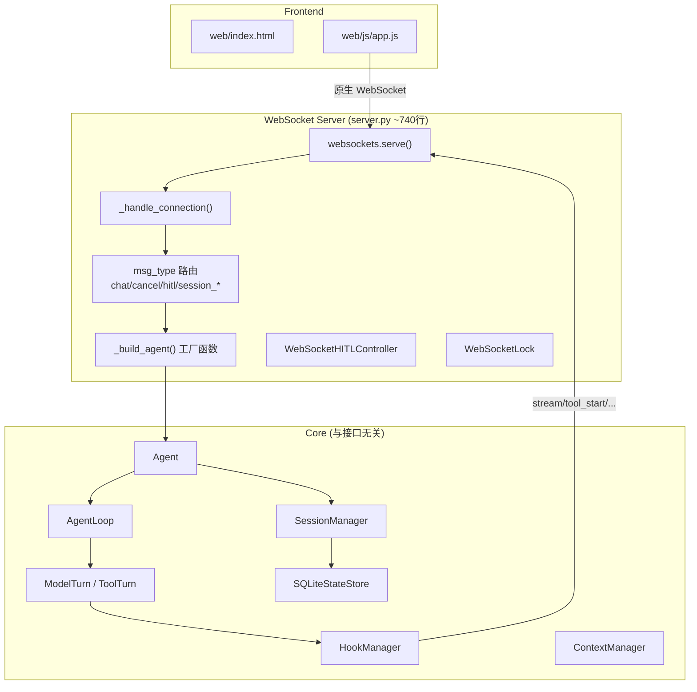
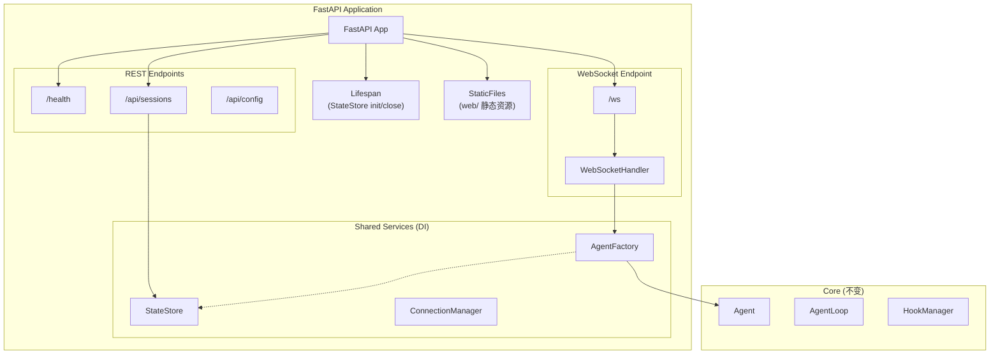

# FastAPI 替代 WebSocket Server 评估报告

## 一、当前架构概览



### 当前设计的关键特征

| 维度 | 现状 |
|------|------|
| **协议** | 纯 WebSocket（`websockets` 库），端口 8765 |
| **静态文件** | 前端 HTML/JS/CSS 需另行部署（独立 HTTP 服务或直接打开文件） |
| **消息路由** | `server.py` L410-444 的 `if-elif` 链，手动 JSON 解析 |
| **Agent 构建** | `_build_agent()` 函数 ~230 行，包含全部组件初始化 + Hook 注册 |
| **会话管理** | 手动维护 `_agents` dict + `_running_tasks` dict |
| **并发控制** | 自建 `WebSocketLock` 类 |
| **错误处理** | 手动 try-catch + JSON 错误消息 |
| **HITL** | `WebSocketHITLController` 通过 `asyncio.Event` 等待审批 |
| **代码复用** | CLI 和 WebSocket 的 `_build_agent` 逻辑高度重复（~70% 相同） |

---

## 二、FastAPI 方案设计评估

### 2.1 FastAPI 能带来什么

| 收益 | 说明 |
|------|------|
| ✅ **统一 HTTP + WebSocket** | 一个端口同时提供 REST API + WebSocket + 静态文件，前端不再需要单独部署 |
| ✅ **自动化路由** | `@app.websocket()` + `@app.get/post()` 替代手工 `if-elif` 路由 |
| ✅ **请求验证** | Pydantic 模型自动校验消息格式，省去手动 `json.loads` + 字段检查 |
| ✅ **REST API 扩展** | 天然支持 REST 端点：健康检查、会话 CRUD、配置查询、metrics |
| ✅ **依赖注入** | `Depends()` 自动管理 StateStore、Agent 实例生命周期 |
| ✅ **中间件生态** | CORS、认证、限流、日志中间件开箱即用 |
| ✅ **OpenAPI 文档** | 自动生成 Swagger UI，方便调试和集成 |
| ✅ **生命周期管理** | `@app.on_event("startup/shutdown")` 或 `lifespan` 管理全局资源 |
| ✅ **已有依赖兼容** | 项目已使用 pydantic v2，FastAPI 完美配合 |

### 2.2 潜在风险与成本

| 风险 | 评估 |
|------|------|
| ⚠️ **WebSocket 行为差异** | FastAPI 的 `WebSocket` 对象 API 与 `websockets` 库略有不同（`send_text` vs `send`），但改动量小 |
| ⚠️ **新增依赖** | 需引入 `fastapi` + `uvicorn`，但它们是 Python 异步 Web 的标准选择 |
| ⚠️ **HITL 机制** | `WebSocketHITLController` 的 `asyncio.Event` 模式与 FastAPI 完全兼容，无需改变 |
| ✅ **Core 层零影响** | Agent / AgentLoop / Turn / HookManager / StateStore 完全不涉及接口层，无需改动 |

### 2.3 不适合 FastAPI 的场景（本项目不存在）

- 纯 TCP/UDP 协议服务 → 不适用
- 极低延迟要求（<1ms）→ 不适用
- 需要自定义 WebSocket 帧协议 → 不适用

---

## 三、当前设计合理性评估

### 3.1 合理的部分

- ✅ **Core 与 Interface 解耦良好**：`Agent` 通过 `HookManager` 事件分发，不依赖具体传输层
- ✅ **Hook 模式优秀**：函数式回调注册，WebSocket 只是 Hook 的消费者
- ✅ **Turn 抽象清晰**：`ModelTurn` / `ToolTurn` 的状态机模式很干净
- ✅ **CancellationToken 设计合理**：协作式取消，跨层传递

### 3.2 不合理的部分（与 FastAPI 无关的技术债）

> [!WARNING]
> 这些问题在是否迁移 FastAPI 之前就存在，迁移时应一并解决。

1. **Agent 构建逻辑重复**：`server.py` 的 `_build_agent()` 和 `cli/main.py` 的 `_chat()` 有 ~70% 重复代码（Provider 构建、Safety、Sandbox、工具注册、系统提示词加载）。应抽取为共享的 `AgentFactory`。

2. **server.py 职责过重**（740 行单文件）：混合了以下职责：
   - WebSocket 服务器启动
   - Agent 工厂
   - Hook 回调注册
   - 会话管理 REST-like 操作（list/create/switch/delete）
   - 消息历史序列化
   - HITL 控制器

3. **前端静态文件无服务**：当前 `web/` 目录的 HTML/CSS/JS 需要另开 HTTP 服务才能访问，无法通过 WebSocket 端口直接服务。

4. **缺少健康检查和监控端点**：纯 WebSocket 无法提供 `/health`、`/metrics` 等运维端点。

5. **消息路由硬编码**：`_handle_connection` 中的 `if-elif` 链随消息类型增长线性增长，且无类型校验。

---

## 四、推荐方案：FastAPI + WebSocket 混合架构



### 4.1 目标文件结构

```
myagent/interfaces/web/
├── __init__.py
├── app.py              # FastAPI 应用入口 + lifespan
├── factory.py          # AgentFactory（从 CLI 和 WS 的重复逻辑中抽取）
├── ws_handler.py       # WebSocket 消息处理（从 server.py 拆分）
├── ws_models.py        # Pydantic 消息模型（类型安全的 WebSocket 消息）
├── routes/
│   ├── sessions.py     # /api/sessions CRUD
│   └── health.py       # /health, /api/config
└── dependencies.py     # FastAPI 依赖注入（StateStore, AgentFactory）
```

### 4.2 核心代码示意

```python
# app.py
from contextlib import asynccontextmanager
from fastapi import FastAPI
from fastapi.staticfiles import StaticFiles

@asynccontextmanager
async def lifespan(app: FastAPI):
    # Startup: 初始化 StateStore
    store = SQLiteStateStore()
    await store.initialize()
    app.state.store = store
    app.state.factory = AgentFactory(config_path="config.yaml", store=store)
    yield
    # Shutdown: 清理
    await store.close()

app = FastAPI(title="MyAgent", lifespan=lifespan)
app.mount("/", StaticFiles(directory="web", html=True), name="static")

# WebSocket endpoint
@app.websocket("/ws")
async def websocket_endpoint(ws: WebSocket):
    await ws.accept()
    handler = WebSocketHandler(ws, app.state.factory, app.state.store)
    await handler.run()
```

```python
# ws_models.py — 类型安全的消息协议
from pydantic import BaseModel, Field
from typing import Literal

class ChatMessage(BaseModel):
    type: Literal["chat"] = "chat"
    text: str = Field(..., min_length=1)

class CancelMessage(BaseModel):
    type: Literal["cancel"] = "cancel"

class SessionSwitchMessage(BaseModel):
    type: Literal["session_switch"] = "session_switch"
    session_id: str

# 使用 discriminated union 自动路由
IncomingMessage = ChatMessage | CancelMessage | SessionSwitchMessage | ...
```

```python
# factory.py — 消除 CLI/WS 重复的 Agent 构建逻辑
class AgentFactory:
    def __init__(self, config_path: str, store: StateStore):
        self._config = load_yaml_config(config_path)
        self._store = store

    def create_agent(
        self,
        hooks: HookManager,
        hitl_callback=None,
        session_id: str | None = None,
    ) -> Agent:
        """统一的 Agent 构建入口，CLI 和 WebSocket 共用。"""
        # Provider、Safety、Sandbox、Tools 构建逻辑只写一次
        ...
```

---

## 五、重构工作量评估

### 5.1 工作量矩阵

| 任务 | 文件 | 代码行数估计 | 难度 | 说明 |
|------|------|:---:|:---:|------|
| 抽取 `AgentFactory` | `factory.py` [新] | ~150 | ⭐⭐ | 从 `server.py` 和 `cli/main.py` 提取公共逻辑 |
| FastAPI 应用骨架 | `app.py` [新] | ~60 | ⭐ | lifespan + mount static + include routers |
| WebSocket Handler | `ws_handler.py` [新] | ~250 | ⭐⭐ | 从 `server.py` 迁移核心逻辑，API 微调 |
| 消息模型 | `ws_models.py` [新] | ~80 | ⭐ | Pydantic 模型定义 |
| REST 路由 | `routes/*.py` [新] | ~100 | ⭐ | 会话 CRUD + 健康检查 |
| 依赖注入 | `dependencies.py` [新] | ~30 | ⭐ | StateStore/Factory 注入 |
| 更新 CLI | `cli/main.py` [改] | ~-100 | ⭐ | 改用 AgentFactory，删除重复代码 |
| 删除旧 server | `websocket/server.py` [删] | ~-740 | ⭐ | 整个文件删除 |
| 更新前端 | `web/js/app.js` [改] | ~10 | ⭐ | WebSocket URL 从 `ws://host:8765` → `ws://host:8000/ws` |
| 更新依赖 | `pyproject.toml` [改] | ~5 | ⭐ | 添加 `fastapi` + `uvicorn` |
| **总净增** | | **~-150 行** | | 重构后代码量反而减少 |

### 5.2 时间估算

| 阶段 | 估时 |
|------|------|
| AgentFactory 抽取 + 单元测试 | 1-2 小时 |
| FastAPI 骨架 + WebSocket Handler 迁移 | 2-3 小时 |
| REST 路由 + 静态文件服务 | 1 小时 |
| 前端适配 + 端对端测试 | 1 小时 |
| **总计** | **5-7 小时** |

---

## 六、结论与建议

### 最终判断：**强烈推荐迁移到 FastAPI**

> [!IMPORTANT]
> 理由总结：
> 1. **设计合理性提升**：FastAPI 天然解决当前 server.py 的多个架构问题（单文件职责过重、无静态文件服务、无 REST API、无请求验证）
> 2. **工作量可控**：Core 层零改动，重构集中在 interface 层，净代码量反而减少
> 3. **技术栈匹配**：项目已使用 pydantic v2 + asyncio，FastAPI 是最自然的选择
> 4. **附赠收益**：自动 OpenAPI 文档、CORS 中间件、依赖注入、生命周期管理
> 5. **社区生态**：FastAPI 是 Python 异步 Web 框架的事实标准，长期维护有保障

### 建议执行顺序

```
Phase A: 抽取 AgentFactory（与 FastAPI 无关，先解决代码重复）
    ↓
Phase B: 搭建 FastAPI 骨架 + 静态文件服务
    ↓
Phase C: 迁移 WebSocket Handler（保持消息协议不变）
    ↓
Phase D: 添加 REST API（会话管理、健康检查）
    ↓
Phase E: 前端适配 + 端对端验证
```

> [!TIP]
> **Phase A 可以独立于 FastAPI 迁移单独完成**。即使最终不迁移 FastAPI，`AgentFactory` 的抽取也是有价值的重构，因为它消除了 CLI 和 WebSocket 之间 ~200 行的重复代码。
