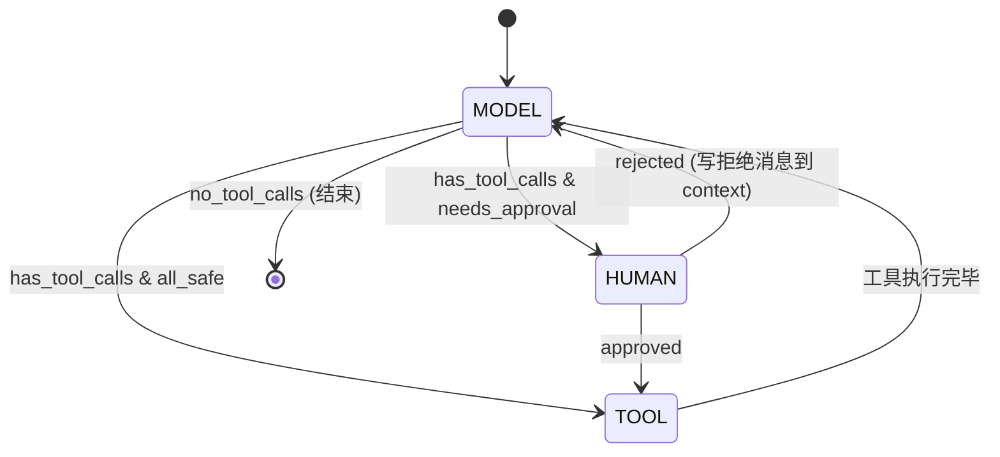

# 会话重构方案

## 背景

当前 `Session` 是一个贫血数据模型（id + state + persist），不符合"session = 有状态的交互过程"这一领域语义。Loop、Turn、Context 散落在 Agent 中，Session 只是个旁观者。

本方案将 Session 升级为**交互过程的容器**，同时新增 **HumanTurn** 将人的交互建模为一等公民。

---

## 一、架构对比

```
现状                                    重构后
────                                    ──────
Agent (胖)                              Agent (薄: 配置 + 会话工厂)
├── _context: ContextManager            ├── _router        (共享)
├── _loop: AgentLoop                    ├── _tool_registry (共享)
│   └── creates Turn                    ├── _hooks         (共享)
├── _executor                           ├── _audit         (共享)
├── _session_manager                    └── _sessions: {id: Session}
│   └── Session ← 贫血数据袋
├── _cancel_token                       Session (厚: 交互过程容器)
└── _audit                              ├── id, state, metadata
                                        ├── _context: ContextManager  (每会话独立)
                                        ├── _loop: AgentLoop          (每会话独立)
                                        │   └── ModelTurn / ToolTurn / HumanTurn
                                        ├── _cancel_token             (每次 run)
                                        ├── persist() / save()
                                        └── run(user_input) → str
```

---

## 二、HumanTurn 设计

### 2.1 为什么需要 HumanTurn

当前 HITL 审批埋在 [ToolExecutor.execute()](file:///Users/xz/myagent/myagent/tools/executor.py#L69-L90) 内部：
- 对 Loop/审计链**不可见**
- 没有看门狗超时保护
- 无法被 CancellationToken 取消
- CLI 和 WebSocket 的审批逻辑混在 executor 中

### 2.2 状态机



### 2.3 HumanTurn 职责

| 职责 | 说明 |
|------|------|
| 审批请求展示 | 通过 hook 事件 `approval_needed` 通知 UI 层 |
| 等待用户输入 | 通过 `asyncio.Future` 异步等待，CLI/WebSocket 各自 resolve |
| 看门狗超时 | 继承 BaseTurn 的 watchdog，超时自动拒绝 |
| 取消检查 | 继承 BaseTurn 的 cancel_token 检查 |
| 审计记录 | `human_turn_start` / `human_turn_end` 事件 |

### 2.4 HumanTurn 代码草案

```python
class HumanTurn(BaseTurn):
    kind = TurnKind.HUMAN
    _stage_name = "human_approval"

    def __init__(self, hooks, cancel_token, audit, watchdog_timeout,
                 approval_handler: Callable | None = None):
        super().__init__(hooks, cancel_token, audit, watchdog_timeout)
        self._approval_handler = approval_handler  # async (tool_calls) -> list[bool]

    async def _do_execute(self, ctx, input_data=None):
        """input_data: list[ToolCall] 需要审批的工具调用"""
        pending_calls = input_data

        # 通过 hook 通知 UI 层
        await self._hooks.emit("approval_needed", ctx, tool_calls=pending_calls)

        if self._approval_handler:
            decisions = await self._approval_handler(pending_calls)
        else:
            # 无 handler，默认全部拒绝
            decisions = [False] * len(pending_calls)

        approved = [tc for tc, ok in zip(pending_calls, decisions) if ok]
        rejected = [tc for tc, ok in zip(pending_calls, decisions) if not ok]

        if rejected:
            # 写拒绝消息到 context，让 LLM 知道
            # (由调用方 Loop 处理)
            pass

        if approved:
            return TurnResult(kind=TurnKind.HUMAN, next_turn=TurnKind.TOOL, data=approved)
        else:
            return TurnResult(kind=TurnKind.HUMAN, next_turn=TurnKind.MODEL, data=rejected)
```

### 2.5 HITL 从 ToolExecutor 中移除

重构后 `ToolExecutor` 不再处理审批逻辑：
- 安全检查（`SafetyGuard.check_tool_call`）**提前到 Loop 层**
- Loop 根据检查结果决定走 TOOL 还是 HUMAN
- ToolExecutor 退化为纯执行器：幂等缓存 → 密钥注入 → 执行

---

## 三、Session 重构

### 3.1 新 Session 类

```python
class Session:
    """一个完整的交互会话：拥有自己的上下文、循环和状态。"""

    def __init__(
        self, *,
        session_id: str | None = None,
        router: ProviderRouter,        # 共享引用
        executor: ToolExecutor,         # 共享引用
        hooks: HookManager,            # 共享引用
        audit: AuditLogger | None,     # 共享引用
        timeout_config: TimeoutConfig,
        max_iterations: int = 50,
        system_prompt: str | None = None,
        state_store: StateStore | None = None,
    ):
        self.id = session_id or uuid4().hex[:16]
        self.created_at = datetime.now(timezone.utc)
        self.state = AgentState.IDLE
        self.metadata: dict = {}

        # Per-session 组件
        self._context = ContextManager(...)
        self._cancel_token: CancellationToken | None = None
        self._state_store = state_store

        # Loop（每会话独立，但引用共享组件）
        self._loop = AgentLoop(
            provider_router=router,
            context=self._context,
            executor=executor,
            hook=hooks,
            max_iterations=max_iterations,
            audit_logger=audit,
            # ...timeout params
        )

        if system_prompt:
            self._context.set_system(system_prompt)

    async def run(self, user_input: str) -> str:
        """在此会话中执行一轮用户交互。"""
        self._cancel_token = CancellationToken()
        self._loop._cancel_token = self._cancel_token

        ctx = HookContext(session_id=self.id)
        self._context.add_user_message(user_input)

        result = await self._loop.run(ctx)
        final = self._loop._hook.finalize_content(ctx, result.text)

        await self.persist(state=AgentState.IDLE)
        return final or ""

    def request_cancel(self, reason, detail=""):
        if self._cancel_token:
            self._cancel_token.cancel(reason, detail)

    # persist / save / restore 保留原有逻辑
```

### 3.2 新 Agent 类

```python
class Agent:
    """变薄：配置持有者 + 会话工厂 + 便捷入口。"""

    def __init__(self, *, router, tool_registry, hooks, audit, ...):
        self._router = router
        self._hooks = hooks
        self._audit = audit
        self._executor = ToolExecutor(registry=tool_registry, ...)
        self._sessions: dict[str, Session] = {}
        self._active: Session | None = None
        # ...保留 timeout_config, system_prompt 等配置

    def create_session(self, session_id=None) -> Session:
        session = Session(
            session_id=session_id,
            router=self._router,
            executor=self._executor,
            hooks=self._hooks,
            audit=self._audit,
            timeout_config=self._timeout_config,
            system_prompt=self._system_prompt,
            state_store=self._state_store,
        )
        self._sessions[session.id] = session
        self._active = session
        return session

    async def run(self, user_input: str) -> str:
        """便捷入口：在活跃会话上执行。"""
        if not self._active:
            self.create_session()
        return await self._active.run(user_input)

    def request_cancel(self, reason, detail=""):
        if self._active:
            self._active.request_cancel(reason, detail)
```

---

## 四、文件级变更清单

| 文件 | 操作 | 说明 |
|------|------|------|
| `core/session.py` | **重写** | Session 升级为交互容器，吸收 Agent 中的 run 逻辑；删除 SessionManager |
| `core/agent.py` | **重写** | 变薄为配置持有者 + 会话工厂 |
| `core/turns.py` | **修改** | 新增 `TurnKind.HUMAN` 和 `HumanTurn` 类 |
| `core/loop.py` | **修改** | 状态机增加 HUMAN 分支；安全检查提前到 Loop 层 |
| `tools/executor.py` | **修改** | 移除 HITL 相关逻辑（hitl_callback、requires_hitl 分支） |
| `core/factory.py` | **适配** | `create_agent()` 适配新 Agent 接口 |
| `core/__init__.py` | **适配** | 导出更新（删除 SessionManager，新增 HumanTurn） |
| `core/hitl.py` | **可能删除/重构** | HITLController 的职责被 HumanTurn + approval_handler 取代 |

---

## 五、关键设计决策（需确认）

> [!IMPORTANT]
> ### 1. ToolExecutor 的归属
> ToolExecutor 内部持有 IdempotencyCache、SafetyGuard、SecretManager。这些是**跨会话共享**还是**每会话隔离**？
> - **推荐**：共享（当前行为），由 Agent 创建后注入每个 Session

> [!IMPORTANT]
> ### 2. 安全检查的位置
> 将 SafetyGuard 的策略检查从 ToolExecutor 移到 Loop 层，ToolExecutor 仅保留执行逻辑。
> - **影响**：ToolExecutor 的 `execute()` 方法会简化，但 Loop 需要感知 SafetyGuard
> - **替代方案**：保留 SafetyGuard 在 executor 中，但让 executor 返回 "needs_approval" 状态而非直接阻塞

> [!IMPORTANT]
> ### 3. HumanTurn 的 approval_handler 来源
> CLI 模式用 `CLIHITLController.request_approval`，WebSocket 用异步 Future。
> - approval_handler 应该注入到 Session 还是 Loop？
> - **推荐**：注入到 Session，由 Session 传给 Loop/HumanTurn

> [!WARNING]
> ### 4. 向后兼容
> 重构后 `Agent.run()` 的外部接口不变（`async def run(user_input: str) -> str`），但内部实现委托给 `Session.run()`。`AgentFactory.create_agent()` 接口也不变。CLI 和 WebSocket 调用方无需改动。

---

## 六、迁移策略

1. **Phase 1**：新增 `HumanTurn`，修改 Loop 状态机，从 ToolExecutor 剥离 HITL 逻辑
2. **Phase 2**：Session 升级，吸收 Agent 中的 run/context/loop 逻辑
3. **Phase 3**：Agent 瘦身，删除 SessionManager，适配 Factory

每个 Phase 完成后验证 CLI 和 WebSocket 均可正常运行。
